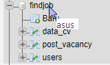

## FindJob
Web Application Portal Vacancy

## Screenshot

## Tutorials (Developers)

[Developers.](tutorial/Developers)

## Tutorials (Non-Developers)

[Non-Developers.](tutorial/Non-Developers)

##Database

lakukan import file *.sql ke dalam database bernama findjob otomatis akan tercipta table-tablenya

## Contact
Interested untuk mengembangkan aplikasi serupa? HUB. dickymujantara@gmail.com
