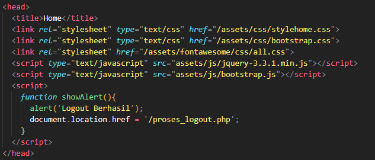
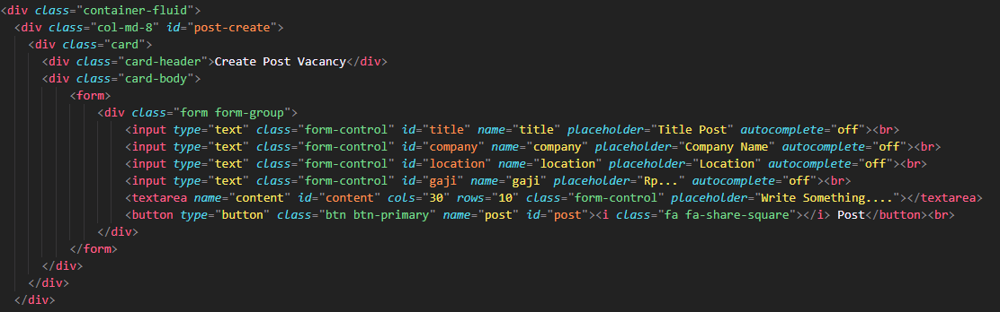
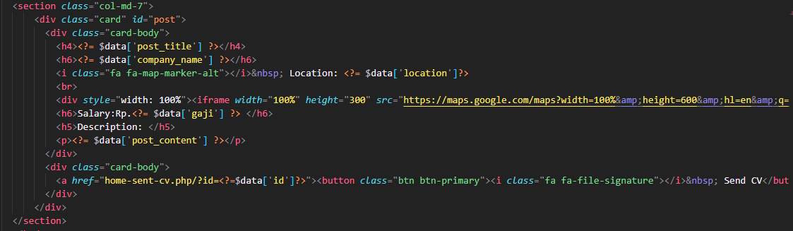
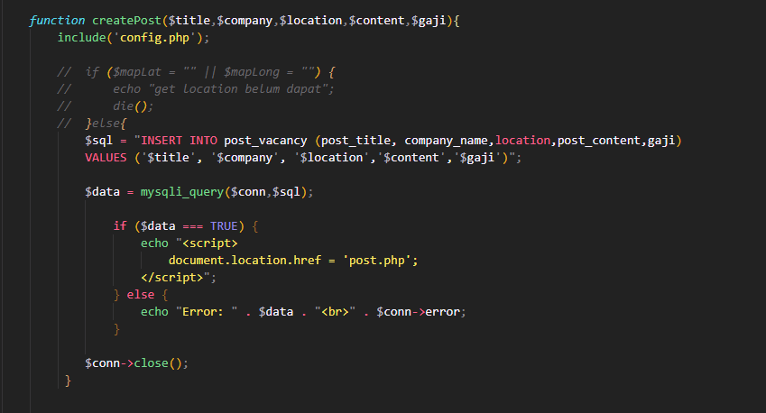
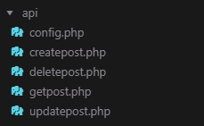

##Tutorials (Developers)

> Customization logo web (Favivcon)
Cari file home.php lalu ubah/tambahkan link icon yg berada pada <head> tag

 

> Untuk mengubah format postingan vacancy terdapat pada post-create.php dan juga pastikan untuk menguhbah view postnya di home-post-view, jangan lupa juga untuk mengubah pada bagian proses_post.php yaitu untuk memasukan data ke database

>Post-Create.php

>Home-Post-View.php

>Proses_Post.php

> untuk menambahkan api juga disarankan untuk dimasukan kedalam folder api/
