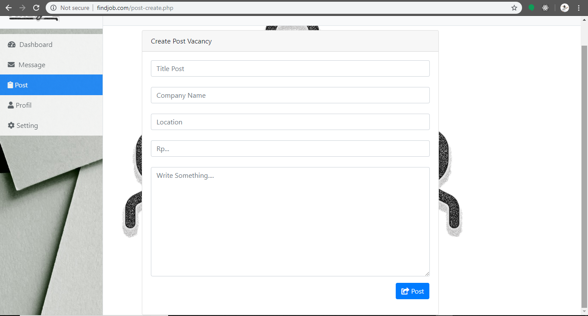
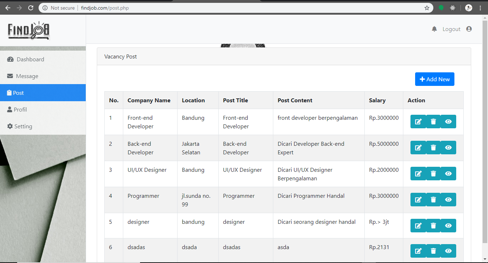
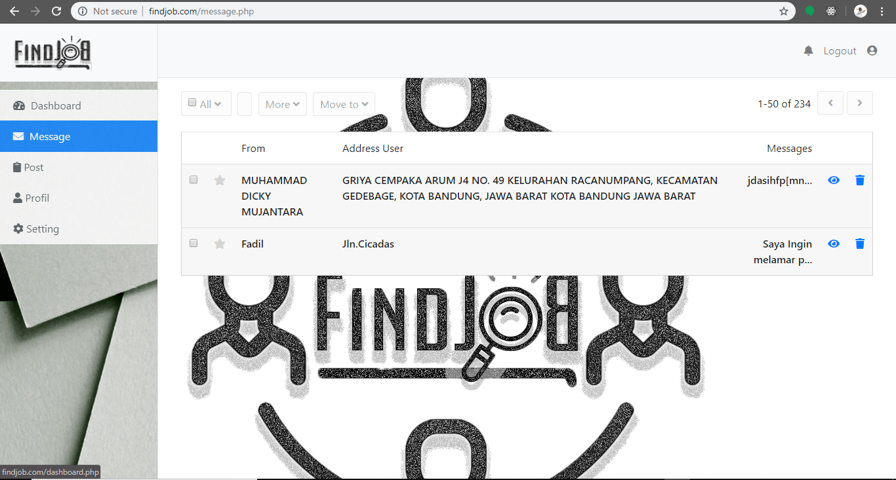

## TUTORIALS (Non-Developers)

> untuk membuat post vacancy bisa dilakukan pada /post-create.php

> untuk melihat post yg sudah di publish dapat dilihat dari /post.php

> dan untuk melihat lamaran yg masuk dapat dilihat di /message-view.php

